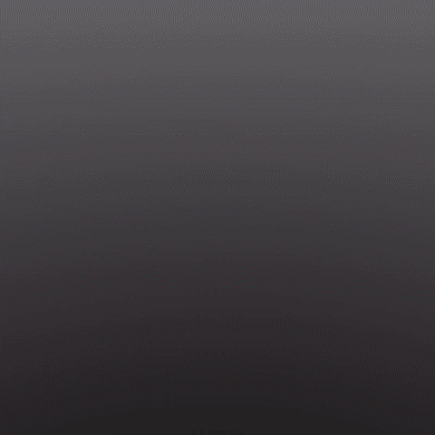
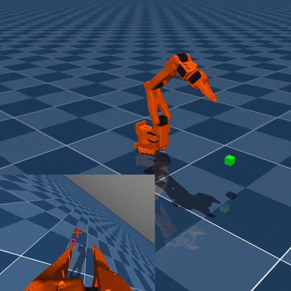

# Reinforcement Learning for the so100 (so-arm100)
A collection of reinforcement learning experiments for the so100 using MuJoCo, Gymnasium, and Stable Baselines3.

## Dependencies

This project uses the [Pixi](https://pixi.sh/) package management tool, you will need to install this.

The following dependencies are used for simulation and RL, all of which are installed as part of the getting started process.
- [MuJoCo](https://mujoco.org/)
- [Gymnasium](https://gymnasium.farama.org/)
- [Stable Baselines3](https://github.com/DLR-RM/stable-baselines3) 

## Getting started

Clone the repo

    git clone https://github.com/lachlanhurst/so100-mujoco-rl.git
    cd so100-mujoco-rl

Install dependencies

    pixi install

The following command will download the so100 MuJoCo model files from the [MuJoCo Menagerie](https://github.com/google-deepmind/mujoco_menagerie) repo. This may take a little while as it downloads all models, then extracts only those for the so100.

    pixi run download

## Training the policy

The following command will start training the robot for Env01 using the PPO reinforcement learning algorithm

    pixi run main -a PPO train -e Env01

Once this is running it's recommended to launch tensorboard in a separate console window, this will provide a web UI to monitor training progress. To do this run the following command, and open the url printed to stdout.

    pixi run tensorboard

## Testing the policy

To test the policy run the following command. An interactive MuJoCo window will open.

    pixi run main -a PPO -m models/Env01_PPO/best_model.zip test -e Env01

To record a video of a simulation using a trained model use the following command.

    pixi run main -a PPO -m models/Env01_PPO/best_model.zip record -e Env01

# Environments

## Env01

so100 starts in any one of a number of starting positions and attempts to reach the green cube. Contact between the arm and cube has been disabled so it will never interact with the cube.

Trains ok using PPO

## Env02

so100 starts in a rest position and reaches for cube, when the cube is reached it is moved to a new location. Contact between the arm and cube has been disabled.

Trains well using PPO, and policy does ok when used on Env01 too

## Env03

Block initially starts in a fixed position, but then starts moving around in a random direction at increasing speed. There is a camera attached to the end of the so100, and from this the scene is rendered offscreen, this render is then run through a YOLO object detection model to get the pixel bounding box coordinates of the cube. The policy is trained to make the arm move so that the cube is always in the center of the camera. This has the effect of getting the robot to look at the cube.

Trains well using PPO, but is very slow due to overhead of offscreen render and running the object detection model. Use Env05 instead.

## Env04

Same offscreen render + object detection approach, but the cube randomly jumps locations instead of moving continuously.

Trains slow (as per Env03), recommend Env05

## Env05

Same as Env03, but uses a simple matrix calculation to reproject the cube location into camera coordinates skipping the need to do the offscreen render and object detection. It is **much** faster to train as a result.

Trains well using PPO
